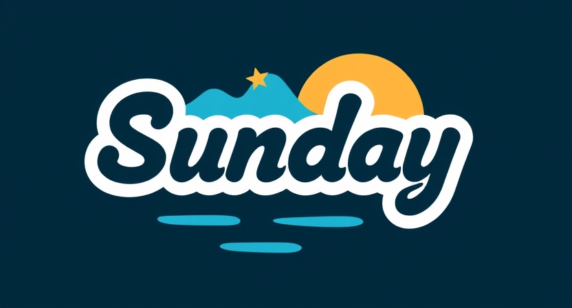
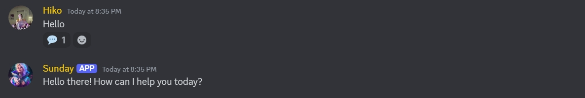
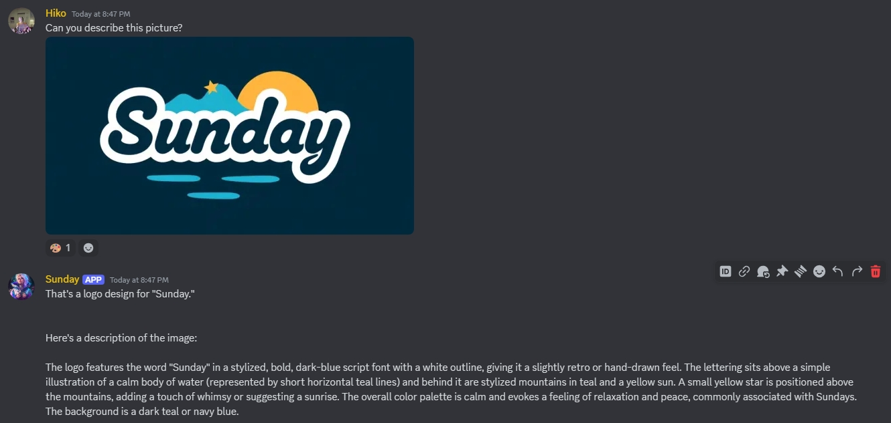
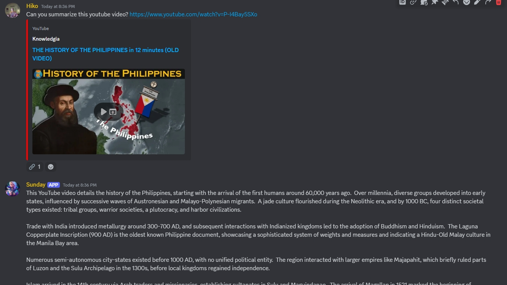
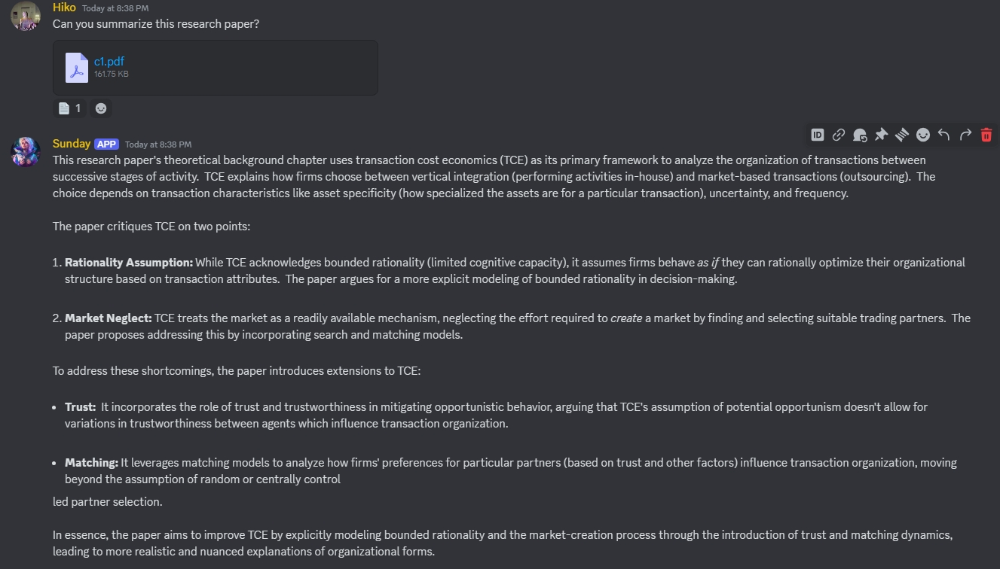

# 🌞 Sunday

Sunday is an innovative AI-driven bot designed to enhance user interactions on Discord. Leveraging Google's generative AI, it provides intelligent text responses and processes images to create engaging conversations. With features like user message history management and customizable settings, Sunday ensures a personalized experience. Additionally, it supports various input formats, including PDFs, TXT files, and YouTube URLs, making it a versatile tool for diverse user needs.

## ✨ Features

- **AI-Driven Text Responses:** Gemini Bot can generate text responses to messages using Google's generative AI.
- **Image Processing:** The bot can also respond to images, combining text and visual inputs for a more engaging interaction. (Images should be under 2.5 Megs)
- **User Message History Management:** It maintains a history of user interactions via discordIDs, allowing for context-aware conversations.
- **Customizable Settings:** Users can adjust various parameters like message history length and AI response settings.

&nbsp;

## 🧑 Author

- [@DarwinRG](https://github.com/DarwinRG)

&nbsp;

## 📒 Requirements

- aiohttp
- discord.py
- google-generativeai
- python-dotenv
- youtube-transcript-api (youtube transcript)
- PyMuPDF (PDF reading)
- requests
- beautifulsoup4 (scraping)
- audioop-lts (only when you are using python 3.13 or newer)

  Recently updated to use Google Flash 1.5 you may need to update your python package

```sh
pip install --upgrade google-generativeai
```
&nbsp;

## 🛠️ Installation

### 📥 Downloading or Cloning the Repository

You can download the repository as a ZIP file and extract it, or you can clone the repository using Git.

#### 📦 Downloading as ZIP

1. Click the "Code" button on the repository page.
2. Select "Download ZIP".
3. Extract the ZIP file to your desired location.

#### 🌀 Cloning with Git

1. Open a terminal.
2. Run the following command to clone the repository:

```sh
git clone https://github.com/DarwinRG/Sunday.git
```

3. Navigate to the project directory:

```sh
cd Sunday
```

### ⚙️ Initial Setup

1. Create a Virtual Environment
   Open a terminal and navigate to the project directory. Then run the following command to create a virtual environment:

```sh
python -m venv .venv
```

2. Activate the Virtual Environment
   > "Remember to re-run this command each time you restart your IDE."

```sh
.\.venv\Scripts\activate
```

3. Install Required Packages
   Once the virtual environment is activated, install the required packages using the following command:

```sh
pip install -U -r requirements.txt
```

&nbsp;

## 🔧 Environment Variables

To run this project, you will need to create a new .env file
```sh
cp .env.example .env
```

Then configure the following variables to the **.env** file

```env
GOOGLE_AI_KEY = "GOOGLE_AI_KEY"

DISCORD_BOT_TOKEN = "DISCORD_BOT_KEY"

MAX_HISTORY = 15

BOT_CHANNEL_ID=
```
&nbsp;

## ▶️ Running the application

After setting up the environment and installing the dependencies, you can run the application with:

```sh
python SundayMain.py
```

&nbsp;

## ☀️ How to use the bot

- **Mention or Chat with the bot in the specified channel to activate it:** Note that history tracking is available for text inputs only.
- **Attach an Image:** The bot will generate an AI-based interpretation or related content.
- **Attach a PDF or TXT file:** The bot will include the content of the file in its response.
- **Include a YouTube URL:** The bot reads the transcript of the video, enabling you to ask questions about its content.
- **Type 'RESET' or 'CLEAN':** Clears the user's message history.

## 🖼️ Screenshots

### Text Prompts


### Image Prompts


### Youtube Video Prompts


### PDF or TXT file Prompts


&nbsp;

## 📜 License

This project is licensed under the Apache License 2.0. See the [LICENSE](LICENSE) file for details.
